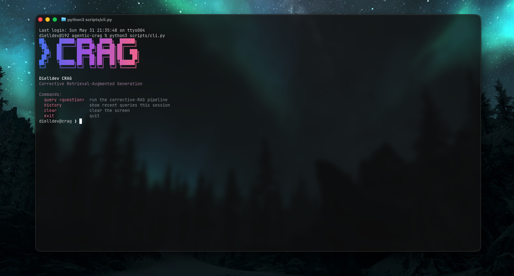

# Agentic CRAG



**Corrective Retrieval-Augmented Generation** — a self-healing RAG pipeline that grades its own retrieval, rewrites bad queries, and falls back to web search before generating an answer.

---

## Why CRAG?

Standard RAG blindly feeds whatever the vector DB returns into the LLM. If the chunks are off-topic, the answer is hallucinated garbage — silently. CRAG fixes this by adding a grading loop: every retrieved chunk is scored for relevance, completeness, and confidence. If the scores are too low, the query gets rewritten and retried. If they're still too low, it falls back to Tavily web search. Only then does it generate — and a final verifier checks whether the answer is actually grounded in the sources.

---

## How it's built

Built as a **stateful LangGraph graph** where each node is a typed agent:

| Agent | Role |
|---|---|
| Retriever | Qdrant vector search → top-k chunks |
| Evaluator | LLM grades each chunk (relevance / completeness / confidence) |
| Rewriter | Reformulates the query when scores are mixed |
| Web Search | Tavily fallback when vector retrieval is too weak |
| Generator | Grounded answer, no hallucination |
| Verifier | Post-generation fact-check — is the answer grounded? |

Routing is driven by the average score across chunks:
- **≥ 70** → generate
- **40–69** and retries left → rewrite → retry
- **< 40** or retries exhausted → web search

**Stack:** LangGraph · Groq (llama-3.3-70b-versatile) · FastEmbed (local CPU embeddings) · Qdrant · Tavily · FastAPI · LangSmith

---

## Setup

**1. Clone and install**
```bash
git clone https://github.com/dielldev/agentic-crag.git
cd agentic-crag
python -m venv .venv && source .venv/bin/activate
pip install -r requirements.txt
```

**2. Configure env**
```bash
cp .env.example .env
# fill in: GROQ_API_KEY, TAVILY_API_KEY, LANGSMITH_API_KEY
```

**3. Start Qdrant**
```bash
docker-compose up -d
```

**4. Ingest knowledge base**
```bash
python scripts/fetch_wikipedia.py
```

**5. Run**
```bash
# CLI (recommended)
python scripts/cli.py

# or API
uvicorn app.api.main:app --reload
```
